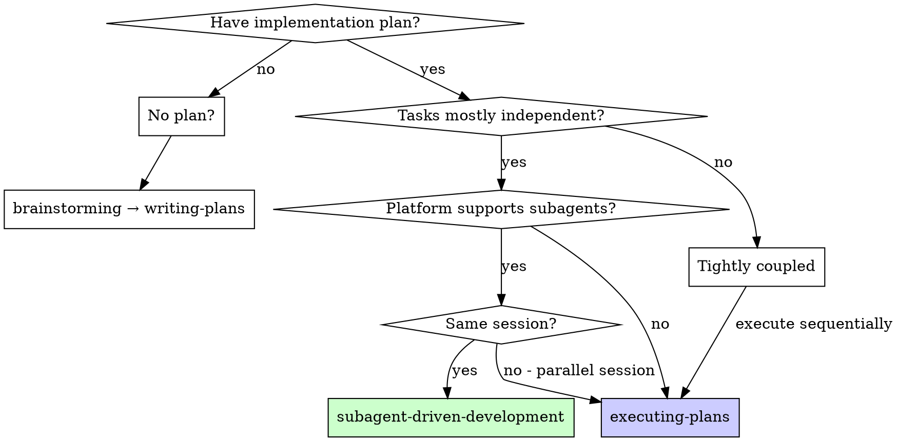

# Executing Plans

## Overview

Load plan, review critically, execute all tasks, report when complete.

**Announce at start:** "I'm using the executing-plans skill to implement this plan."

**Note:** This skill is the fallback for platforms without subagent support or when you need a parallel session. If subagents are available and you're staying in the current session, use `subagent-driven-development` instead.

## Execution Strategy Decision

Determine the correct execution mode before starting:

| Situation | Use | Instead |
|-----------|-----|---------|
| No plan yet | — | `brainstorming` → `writing-plans` |
| Plan exists, tightly coupled tasks | **THIS SKILL** (sequential) | — |
| Plan exists, subagents available, same session | — | `subagent-driven-development` |
| Plan exists, NO subagents, or parallel session | **THIS SKILL** | — |

**Default rule:** If subagents are available and tasks are independent, prefer `subagent-driven-development`. Use this skill for sequential execution, parallel sessions, or when subagents are unavailable.

## The Process

### Step 0: Validate Worktree
**Before doing anything else, verify you are in a git worktree:**
1. Check if the current directory is inside a git worktree (not the main repository checkout)
2. If not in a worktree: **STOP** and invoke `using-git-worktrees` to create one
3. Do not proceed until running inside a worktree

### Step 1: Load and Review Plan
1. Read the **Macro Plan** file (`plan.md`) to understand the full roadmap
2. Review critically - identify any questions or concerns about the plan
3. If concerns: Raise them with your human partner before starting
4. If no concerns: proceed to Step 1.5

### Step 1.5: Identify and Load Required Skills
**Before creating TodoWrite or executing any task, discover and load ALL relevant skills:**

1. **Extract explicit skill references:** Read the plan and list every `<skill-name>` mentioned or implied (e.g., testing → `test-driven-development`, debugging → `systematic-debugging`, review → `receiving-code-review`, etc.)

2. **Invoke `find-skills` for discovery:**
   - **Load `find-skills` FIRST** using the `Skill` tool
   - Use `find-skills` to discover additional skills relevant to the plan's domain that the plan did NOT mention explicitly
   - Search queries should be based on the plan's tech stack and tasks (e.g., if the plan builds a React UI → search for React skills; if it uses Hono → search for API skills; if it uses Flutter → search for Flutter skills)
   - Combine results from both explicit references AND `find-skills` discovery into a single list

3. **Load every relevant skill:** Use the `Skill` tool to load each identified/discovered skill into context BEFORE starting execution

4. **If the plan does not mention skills explicitly AND `find-skills` found nothing:** Infer them from the plan content:
   - Any test-writing task → load `test-driven-development`
   - Any bug fix or unexpected behavior → load `systematic-debugging`
   - Any creative/feature work → load `brainstorming`
   - Any code review step → load `receiving-code-review` or `requesting-code-review`
   - Any verification/claim of "done" → load `verification-before-completion`

5. **Confirm loaded skills:** Announce which skills were loaded and why, distinguishing between:
   - Plan-explicit skills
   - `find-skills` discovered skills
   - Inferred skills

6. **Create TodoWrite and proceed to execution**

**Why this matters:** The plan was written by a human or another agent who may not know about every skill in the ecosystem. `find-skills` acts as a safety net, ensuring you discover domain-specific skills (React, Flutter, Hono, design systems, etc.) that the plan author may have missed. **Never execute a plan without first running `find-skills` to discover the optimal skill set.**

### Step 2: Execute Tasks

For each task listed in the Macro Plan:
1. **Read the task file** (`task-NN-<name>.md`) assigned to this step
2. Mark as in_progress in TodoWrite
3. **If `test-driven-development` is loaded and this task writes/modifies code:**
   - **Enforce TDD cycle automatically**, regardless of the order in the task file.
   - If the task says "implement X" without a preceding failing test, **STOP** and:
     1. Write the failing test first (RED).
     2. Run it to confirm it fails.
     3. Then follow the task's implementation step (GREEN).
     4. Run the test to confirm it passes.
     5. Refactor if the task includes a refactor step or if you see cleanup opportunities.
   - If the task already follows TDD order (test first, then implement), execute it exactly as written.
   - **Never write production code without a failing test first.** If a task has no test step and writes code, add the test step yourself before touching implementation.
4. **If the task contains `**Visual Reference:**`:**
   - Open the referenced mock file and section before writing any code.
   - Use the mock as the visual specification: replicate its HTML structure, CSS classes, layout, spacing, colors, and typography.
   - The final implementation must be visually faithful to the approved mock.
5. Follow each step exactly (task files have bite-sized steps)
6. Run verifications as specified
7. Mark as completed in TodoWrite

### Step 3: Complete Development

After all tasks complete and verified:
- Announce: "I'm using the finishing-a-development-branch skill to complete this work."
- **REQUIRED SUB-SKILL:** Use finishing-a-development-branch
- Follow that skill to verify tests, present options, execute choice

## When to Stop and Ask for Help

**STOP executing immediately when:**
- Hit a blocker (missing dependency, test fails, instruction unclear)
- Plan has critical gaps preventing starting
- You don't understand an instruction
- Verification fails repeatedly

**Ask for clarification rather than guessing.**

## When to Revisit Earlier Steps

**Return to Review (Step 1) when:**
- Partner updates the plan based on your feedback
- Fundamental approach needs rethinking

**Don't force through blockers** - stop and ask.

## Remember
- Review plan critically first
- Follow plan steps exactly
- Don't skip verifications
- Reference skills when plan says to
- Stop when blocked, don't guess
- Never start implementation on main/master branch without explicit user consent

## Integration

**Required workflow skills:**
- **using-git-worktrees** - Ensures isolated workspace (creates one or verifies existing)
- **writing-plans** - Creates the plan this skill executes
- **finishing-a-development-branch** - Complete development after all tasks
- **find-skills** - Discovers domain-specific skills the plan may have missed
