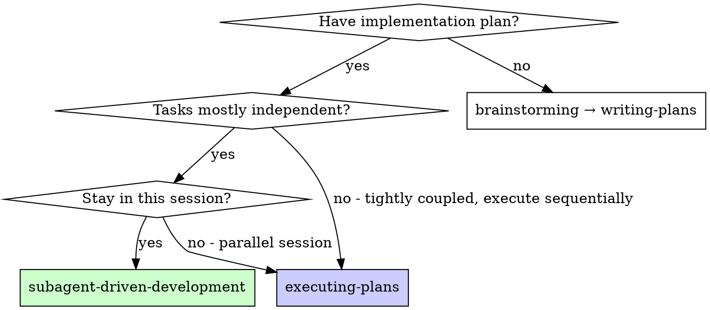
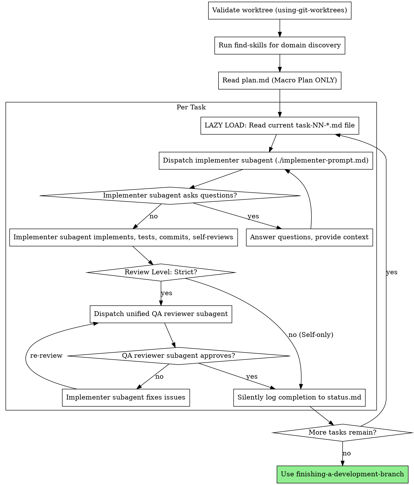

# Subagent-Driven Development

Execute plan by dispatching fresh subagent per task, with two-stage review after each: spec compliance review first, then code quality review.

**Why subagents:** You delegate tasks to specialized agents with isolated context. By precisely crafting their instructions and context, you ensure they stay focused and succeed at their task. They should never inherit your session's context or history — you construct exactly what they need. This also preserves your own context for coordination work.

**Core principle:** Fresh subagent per task + unified QA review = high quality, fast iteration, token efficiency.

**Continuous execution:** Do not pause to check in with your human partner between tasks. Execute all tasks from the plan without stopping. Maintain progress updates silently in a background `status.md` file rather than outputting verbose logs to the chat. The only reasons to stop are: BLOCKED status you cannot resolve, ambiguity that genuinely prevents progress, or all tasks complete.

## When to Use



**This diagram is the unified execution strategy.** It is identical to the one in `executing-plans`. Both skills use the same decision flow.

**vs. Executing Plans:**
| Aspect | subagent-driven-development | executing-plans |
|--------|----------------------------|-----------------|
| Session | Same session | Parallel session or no subagents |
| Agents | Fresh subagent per task | Inline (you execute) |
| Review | Unified QA review per task (if Strict) | Checkpoints at your discretion |
| Speed | Faster iteration, no human-in-loop | Human-in-loop, context preserved |
| Best for | Independent tasks, subagent support | Tightly coupled tasks, no subagent support |

## The Process



## Model Selection

Use the least powerful model that can handle each role to conserve cost and increase speed.

**Mechanical implementation tasks** (isolated functions, clear specs, 1-2 files): use a fast, cheap model. Most implementation tasks are mechanical when the plan is well-specified.

**Integration and judgment tasks** (multi-file coordination, pattern matching, debugging): use a standard model.

**Architecture, design, and review tasks**: use the most capable available model.

**Task complexity signals:**
- Touches 1-2 files with a complete spec → cheap model
- Touches multiple files with integration concerns → standard model
- Requires design judgment or broad codebase understanding → most capable model

## Handling Implementer Status

Implementer subagents report one of four statuses. Handle each appropriately:

**DONE:** Proceed to spec compliance review.

**DONE_WITH_CONCERNS:** The implementer completed the work but flagged doubts. Read the concerns before proceeding. If the concerns are about correctness or scope, address them before review. If they're observations (e.g., "this file is getting large"), note them and proceed to review.

**NEEDS_CONTEXT:** The implementer needs information that wasn't provided. Provide the missing context and re-dispatch.

**BLOCKED:** The implementer cannot complete the task. Assess the blocker:
1. If it's a context problem, provide more context and re-dispatch with the same model
2. If the task requires more reasoning, re-dispatch with a more capable model
3. If the task is too large, break it into smaller pieces
4. If the plan itself is wrong, escalate to the human

**Never** ignore an escalation or force the same model to retry without changes. If the implementer said it's stuck, something needs to change.

## Prompt Templates

- `./implementer-prompt.md` - Dispatch implementer subagent
- `./qa-reviewer-prompt.md` - Dispatch unified QA reviewer subagent (checks both spec compliance and code quality)

### Visual Mock Reference

When a task includes `**Visual Reference:**`, the controller MUST include the mock content (or a clear description of the referenced section) in the implementer prompt. The implementer should treat the mock as part of the spec. The QA reviewer MUST verify that the implemented output matches the mock's structure, layout, and styling.

## Example Workflow

```
You: I'm using Subagent-Driven Development to execute this plan.

[Validate worktree using using-git-worktrees]
[Run find-skills to discover domain-specific skills]
[Read plan.md once: docs/plans/YYYY-MM-DD-feature/plan.md]
[Create TodoWrite with tasks]

Task 1: Hook installation script

[LAZY LOAD: Read task-01-*.md file contents, context, and **Skills & Rules:** annotations]
[Include Skills & Rules in implementer prompt so subagent loads them]
[Dispatch implementation subagent with full task file text + context + Skills & Rules list]

Implementer: "Before I begin - should the hook be installed at user or system level?"

You: "User level (~/.config/agent/hooks/)"

Implementer: "Got it. Implementing now..."
[Later] Implementer:
  - Implemented install-hook command
  - Added tests, 5/5 passing
  - Self-review: Found I missed --force flag, added it
  - Committed

[Dispatch unified QA reviewer]
QA Reviewer: ✅ Spec compliant and Code Quality approved. No issues.

[Silently log completion to status.md]

Task 2: Recovery modes

[LAZY LOAD: Read task-02-*.md file contents, context, and **Skills & Rules:** annotations]
[Include Skills & Rules in implementer prompt so subagent loads them]
[Dispatch implementation subagent with full task file text + context + Skills & Rules list]

Implementer: [No questions, proceeds]
Implementer:
  - Added verify/repair modes
  - 8/8 tests passing
  - Self-review: All good
  - Committed

[Dispatch unified QA reviewer]
QA Reviewer: ❌ Issues:
  - Spec: Missing progress reporting (spec says "report every 100 items")
  - Spec: Extra --json flag added (not requested)
  - Quality: Magic number (100) used directly in code

[Implementer fixes issues]
Implementer: Removed --json flag, added progress reporting, extracted PROGRESS_INTERVAL constant

[QA Reviewer reviews again]
QA Reviewer: ✅ Spec compliant and Code Quality approved. No issues.

[Silently log completion to status.md]

...

[After all tasks]
Done!

Done!
```

## Advantages

**vs. Manual execution:**
- Subagents follow TDD naturally
- Fresh context per task (no confusion)
- Parallel-safe (subagents don't interfere)
- Subagent can ask questions (before AND during work)

**vs. Executing Plans:**
- Same session (no handoff)
- Continuous progress (no waiting)
- Review checkpoints automatic

**Efficiency gains:**
- No file reading overhead (controller provides full text)
- Controller curates exactly what context is needed
- Subagent gets complete information upfront
- Questions surfaced before work begins (not after)

**Quality gates:**
- Self-review catches issues before handoff
- Unified QA review: spec compliance + code quality together
- Review loops ensure fixes actually work
- Spec compliance prevents over/under-building
- Code quality ensures implementation is well-built

**Cost:**
- More subagent invocations (implementer + 2 reviewers per task)
- Controller does more prep work (extracting all tasks upfront)
- Review loops add iterations
- But catches issues early (cheaper than debugging later)

## Red Flags

**Never:**
- Start implementation on main/master branch without explicit user consent
- Skip reviews (spec compliance OR code quality)
- Proceed with unfixed issues
- Dispatch multiple implementation subagents in parallel (conflicts)
- Make subagent read task files from disk (provide full file contents in the prompt instead)
- Skip scene-setting context (subagent needs to understand where task fits)
- Ignore subagent questions (answer before letting them proceed)
- Accept "close enough" on spec compliance (QA reviewer found issues = not done)
- Skip review loops (QA reviewer found issues = implementer fixes = review again)
- Let implementer self-review replace actual review (unless task was explicitly marked Self-only)
- Move to next task while QA review has open issues

**If subagent asks questions:**
- Answer clearly and completely
- Provide additional context if needed
- Don't rush them into implementation

**If reviewer finds issues:**
- Implementer (same subagent) fixes them
- Reviewer reviews again
- Repeat until approved
- Don't skip the re-review

**If subagent fails task:**
- Dispatch fix subagent with specific instructions
- Don't try to fix manually (context pollution)

## Integration

**Required workflow skills:**
- **using-git-worktrees** - Ensures isolated workspace (creates one or verifies existing)
- **writing-plans** - Creates the plan this skill executes (includes TDD-by-default and skill annotations)
- **find-skills** - Discovers domain-specific skills before execution
- **requesting-code-review** - Code review template for reviewer subagents
- **finishing-a-development-branch** - Complete development after all tasks
- **verification-before-completion** - Subagents must verify before claiming DONE

**Subagents MUST use:**
- **extreme-brevity** - Subagents MUST communicate using caveman style to prevent context window bloat for the controller agent.
- **test-driven-development** - TDD is mandatory, not optional, for every task

**Alternative workflow:**
- **executing-plans** - Use for parallel session instead of same-session execution
